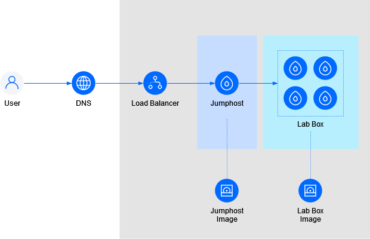

Virtua Lab lets you build your own cloud virtual machine lab, whether you want to teach a class,
train professionals, run a hackathon, host a hands-on-lab, etc.

The lab infrastructure runs on DigitalOcean infrastructure. It
consists of a jumphost running [Apache Guacamole](https://guacamole.apache.org/) and as many
lab boxes as you want (or can) spin up.

## Architecture




## Prerequisites

You will need the following software to build the lab:

 * [Terraform](https://www.terraform.io/), or alternatively [OpenTofu](https://opentofu.org/) (not tested) to provision the DigitalOcean resources
 * [Packer](https://www.packer.io/) to create the VM images (jumphost and lab boxes)
 * [VirtualBox](https://www.virtualbox.org/)
 * [Python 3](https://www.python.org/)

Obviously, you will also need a DigitalOcean subscription. Get $200 of credit using the following link:

[](https://www.digitalocean.com/?refcode=1ec7baf80a5d&utm_campaign=Referral_Invite&utm_medium=Referral_Program&utm_source=badge)

## Setup Instructions

### DNS Setup

You need to delegate your lab DNS domain to digitalocean. To update your domain's delegation,
use the following name server addresses at the registrar:

```
ns1.digitalocean.com
ns2.digitalocean.com
ns3.digitalocean.com
```

For details, see: [Point to DigitalOcean Name Servers From Common Domain Registrars](https://docs.digitalocean.com/products/networking/dns/getting-started/dns-registrars/).

### Add your SSH key

Add at least one SSH key to your DigitalOcean account. This will be used to access your running droplets. See [How to Add SSH Public Keys to DigitalOcean](https://docs.digitalocean.com/platform/teams/upload-ssh-keys/) for details.


## Tips / Tricks

### Increase Droplet Limit

If you need to create more droplets than your current limit allows, you can request an increase. See [How do I increase my Droplet limit?](https://www.digitalocean.com/community/questions/how-do-i-increase-my-droplet-limit) for details.